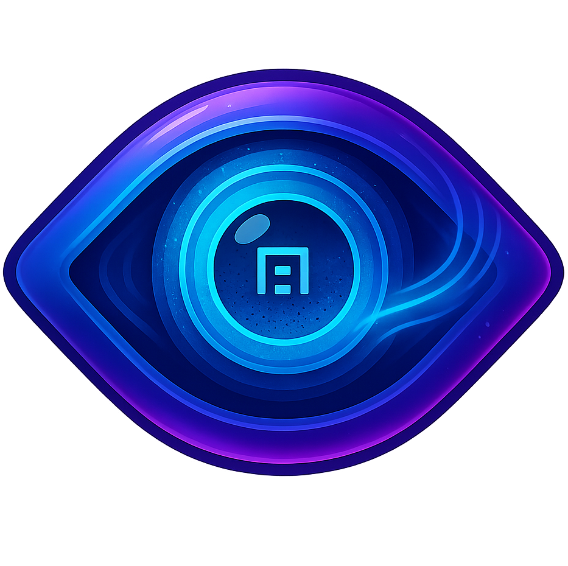

# Apochron - Autostereogram Decoder

Decode autostereograms into depth maps. For the 5-10% of people who can't view autostereograms directly, Apochron reveals the hidden 3D structure by extracting the depth information.

**Live App:** [nqrlabs.com/Apochron/](https://nqrlabs.com/Apochron/)

## What Does Apochron Do?

Apochron is the **inverse** of [Apoculus](https://nqrlabs.com/Apoculus/). While Apoculus creates autostereograms from depth maps, Apochron extracts depth maps from autostereograms.

- **Input:** An autostereogram image (3D magic eye picture)
- **Output:** A grayscale depth map showing the hidden 3D structure
  - White = objects close to viewer
  - Black = objects far from viewer

## How It Works

### Algorithm Overview

Apochron uses a **pattern correlation algorithm** to detect repeating structures:

1. **Scanline Analysis:** For each horizontal line of the image
2. **Period Detection:** Test different pattern repetition periods (widths)
3. **Correlation Matching:** Find the period with the strongest pattern match
4. **Depth Mapping:** Smaller periods = closer objects, larger periods = farther objects
5. **Occlusion Detection:** Fix pixels at vertical contours where pattern matching fails
6. **Smoothing & Enhancement:** Apply blur and contrast adjustment for cleaner output

### Technical Details

The algorithm is based on inverting the autostereogram generation process:

- Autostereograms encode depth by **shifting repeating patterns horizontally**
- The shift amount (disparity) determines depth
- By finding where patterns repeat most strongly, we can reverse-engineer the depth

**Pattern Matching:**
- For each pixel, compare it with pixels to the right at various distances
- Use a sliding window to compute color similarity scores
- The distance with the best match indicates the original pattern period
- Convert period to depth: `depth = 255 × (1 - (period - min) / (max - min))`

**Occlusion Handling:**
- **Problem:** At vertical contours, some pixels have no matching pattern (stereo occlusion)
- **Detection:** Compare each pixel to neighbors; flag if difference > threshold (16/255)
- **Correction:** Replace outlier with **majority value (mode)** from 5×5 neighborhood
- **Why majority?** Preserves sharp depth levels better than averaging/blurring
- **Result:** Crisp contours at horizontal transitions, cleaned up vertical edges

**Optimizations:**
- **Bit-depth quantization:** Reduce grayscale to 5-6 bit (32-64 levels) to bin similar colors together
  - Makes pattern matching more robust to JPEG artifacts and compression noise
  - Similar pixel values are treated as identical, improving correlation accuracy
- **Precomputed grayscale:** Convert RGB→grayscale once per row, not per comparison
- **Squared distance:** No expensive Math.sqrt() calls
- **Separable blur:** Split 2D smoothing into horizontal + vertical passes
- **Window size:** 5 pixels (±2 around target) balances accuracy and speed

## Features

### Decoding Parameters

- **Min/Max Pattern Width** - Expected range of repeating pattern sizes (default: 47-97px)
- **Smoothing** - Blur amount to reduce noise (0-10, default: 2)
- **Sensitivity** - Contrast enhancement multiplier (1-20, default: 5)
- **Invert Depth Map** - Flip near/far relationship in output

### User Interface

- **Side Panel** - All controls in a clean, organized layout
- **Preview Canvas** - Real-time display of decoded depth map
- **Load Image** - Drag-and-drop or click to upload autostereogram
- **Download** - Save depth map as PNG

## How to Use

### Basic Workflow

1. **Load Autostereogram**
   - Click "Choose Image" and select an autostereogram file
   - The original image will appear in the preview

2. **Click "Decode Depth Map"**
   - Apochron will analyze the image and extract the depth information
   - The preview will update to show the grayscale depth map

3. **Adjust Parameters** (optional)
   - If the result looks noisy, increase **Smoothing**
   - If depth variation is too subtle, increase **Sensitivity**
   - If pattern sizes differ, adjust **Min/Max Pattern Width**
   - Click "Decode Depth Map" again to re-process

4. **Download Result**
   - Click "Download Depth Map" to save as PNG

### Tips for Best Results

**Pattern Width Settings:**
- Most autostereograms use pattern widths between 50-90 pixels
- If output is flat/uniform, try expanding the range (e.g., 30-120)
- Narrow the range if you know the approximate pattern size

**Smoothing:**
- Use higher smoothing (5-8) for noisy or low-quality autostereograms
- Use lower smoothing (0-2) for clean, high-quality images
- Too much smoothing will blur depth edges

**Sensitivity:**
- Higher values = stronger contrast in depth map
- Lower values = more subtle depth variations
- Adjust until foreground/background are clearly separated

**Image Quality:**
- Works best with clean, uncompressed autostereograms
- JPEG artifacts can reduce accuracy
- Larger images generally produce better results

## Limitations

- **Not Perfect:** Autostereogram decoding is inherently ambiguous - there's no perfect inverse
- **Noise Sensitivity:** Random-dot patterns can be difficult to correlate accurately
- **Edge Artifacts:** Sharp depth transitions may produce ripples or noise
- **Pattern Assumptions:** Algorithm assumes horizontal repeating patterns (standard for most autostereograms)
- **Processing Time:** Large images may take a few seconds to decode

## Use Cases

- **Accessibility:** Allow people who can't view stereograms to see the hidden content
- **Analysis:** Study autostereogram structure and depth encoding
- **Education:** Demonstrate how autostereograms work
- **Debugging:** Verify depth maps when creating autostereograms with Apoculus
- **Curiosity:** Explore the hidden 3D worlds in classic Magic Eye images

## Browser Compatibility

- **Modern Browsers:** Chrome, Firefox, Safari, Edge (latest versions)
- **Mobile Support:** Works on iOS Safari and Android Chrome
- **No Dependencies:** Pure vanilla JavaScript, no frameworks required

## Privacy

Apochron runs entirely in your browser. No data is uploaded to any server:
- ✅ All images stay on your device
- ✅ No tracking or analytics
- ✅ No external dependencies
- ✅ Works offline after initial load

## Technical Background

### Why Is This Hard?

Autostereogram decoding is the **inverse problem** of stereogram generation, which is inherently ill-posed:

1. **Information Loss:** The encoding process loses information (multiple depth maps can produce similar stereograms)
2. **Noise:** Random dot patterns introduce correlation noise
3. **Ambiguity:** Local patterns may match multiple periods

### How Apochron Solves It

- **Robust Matching:** Uses windowed correlation to reduce noise sensitivity
- **Period Search:** Tests a range of likely pattern sizes
- **Smoothing:** Post-processing reduces high-frequency artifacts
- **Contrast Enhancement:** Histogram stretching improves depth visibility

### Comparison to Stereo Vision

This problem is similar to **stereo correspondence** in computer vision:
- Traditional stereo uses two camera views to find disparity
- Autostereograms encode disparity in a single repeating pattern
- We search for the pattern period instead of matching between two images

## License

MIT License - See [LICENSE](LICENSE) file for details.

Created by **NQR** for the NQR Labs ARG toolkit.

## Support & Feedback

- **Issues & Suggestions:** https://github.com/NQRLabs/nqrlabs.github.io/issues
- **Website:** https://nqrlabs.com
- **Discord:** https://discord.gg/HT9YE8rvuN

---

© 2025 NQR | Part of the [NQR Labs](https://nqrlabs.com) ARG Toolkit
